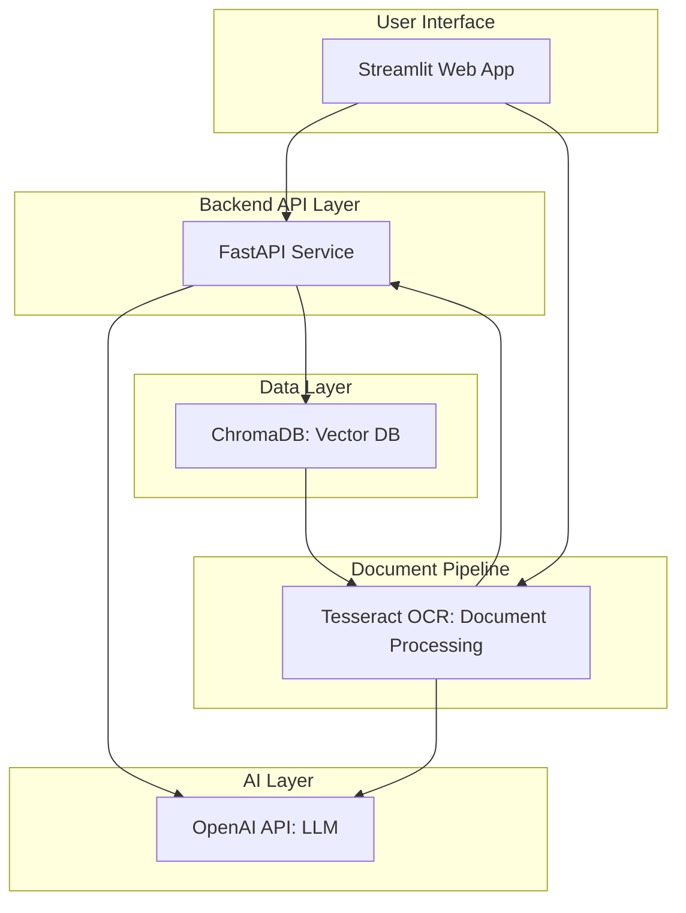
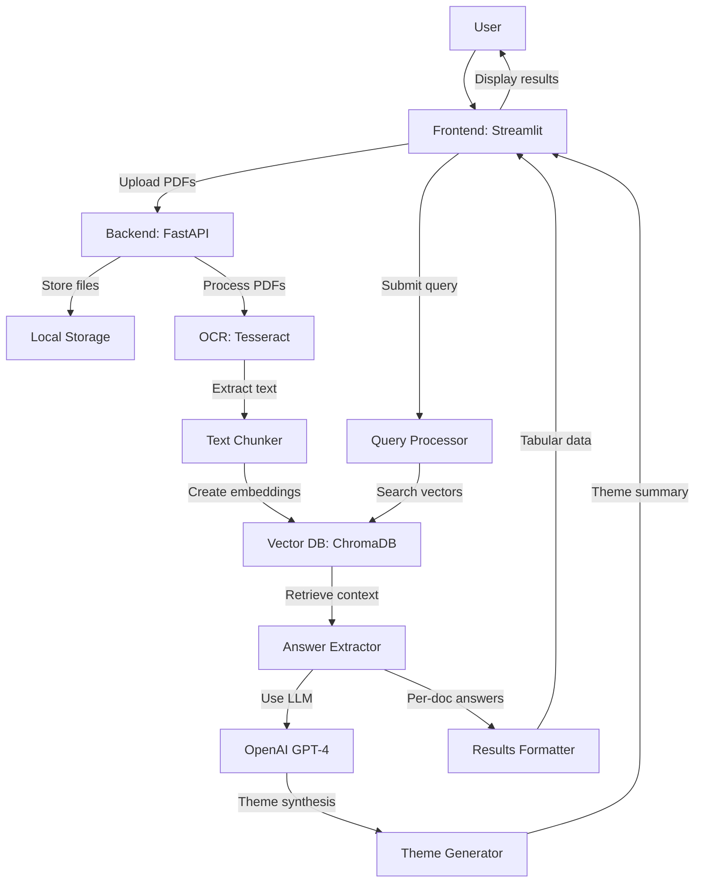
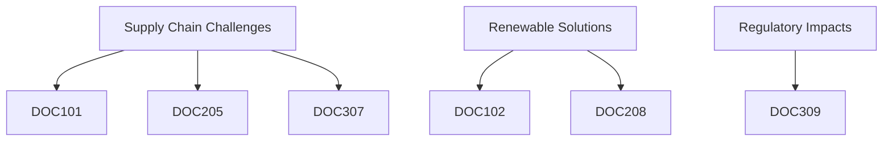

# Comprehensive overview with a data flow diagram (DFD) and workflow description for document analysis chatbot:
---

### System Architecture Diagram
---


### Data Flow Diagram (DFD)
---


### Workflow Architecture
---

**Document Ingestion Pipeline**
   - Input: PDF documents (scanned or text-based)
   - Processing Steps:
     ```mermaid
     graph LR
         A[PDF Upload] --> B[Binary Storage]
         B --> C{Is Scanned?}
         C -->|Yes| D[Tesseract OCR]
         C -->|No| E[PyPDF2 Extraction]
         D & E --> F[Text Normalization]
         F --> G[Paragraph Chunking]
         G --> H[Metadata Generation]
         H --> I[Embedding Creation]
         I --> J[Vector DB Storage]
     ```
   - Output: Vector embeddings with metadata (doc_id, page numbers, paragraph IDs)

 **Query Processing Workflow**
   ```mermaid
   graph LR
       A[User Query] --> B[Preprocessing]
       B --> C[Embedding Creation]
       C --> D[Vector Similarity Search]
       D --> E[Context Retrieval]
       E --> F[Document Filtering]
       F --> G[Per-Doc Answer Extraction]
       G --> H[Theme Synthesis]
       H --> I[Result Formatting]
       I --> J[Response Delivery]
   ```

**Theme Synthesis Engine**
   - Input: List of document answers
   - Processing:
     ```mermaid
     graph LR
         A[Document Answers] --> B[Cluster Similar Concepts]
         B --> C[Identify Common Themes]
         C --> D[Generate Theme Summaries]
         D --> E[Map to Source Documents]
         E --> F[Extract Supporting Evidence]
         F --> G[Create Visual Mapping]
     ```
   - Output: Structured theme hierarchy with document references

### Component Specification
---

1. **Frontend (Streamlit)**
   - Modules:
     - DocumentManager: File upload & filtering
     - QueryInterface: Natural language input
     - ResultsDisplay: 
       - DocumentAnswersTable (with citation links)
       - ThemeVisualizer (interactive network graph)
     - FilterPanel: Document inclusion/exclusion toggles

2. **Backend (FastAPI)**
   - Endpoints:
     - POST /ingest: PDF processing
     - POST /query: Question answering
     - GET /documents: List available docs
     - DELETE /documents/{doc_id}: Remove document
   - Services:
     - OCRService: Handles text extraction
     - VectorManager: DB operations
     - AnswerEngine: Coordinates processing
     - ThemeSynthesizer: Cross-document analysis

3. **AI Processing Layers**
   - Embedding Layer: text-embedding-3-small
   - Extraction Layer: GPT
   - Synthesis Layer: GPT (with chain-of-density prompting)
   - Prompt Engineering:
     ```python
     THEME_PROMPT = """
     Analyze the following document responses to identify 3-5 core themes.
     For each theme:
     1. Provide a concise summary (1-2 sentences)
     2. List supporting document IDs (format: DOCxxx)
     3. Include 1-2 key points per document
     4. Note conflicting viewpoints if any
     
     Structure:
     [Theme Title]: [Summary]
     • [DOCxxx]: [Key point] ([Page Reference])
     • [DOCyyy]: [Key point] ([Page Reference])
     """
     ```

### Data Flow Sequence
---
1. User uploads PDFs → Stored in backend/data
2. System processes documents → Creates vector embeddings
3. User submits query + selects documents to include
4. System performs vector similarity search
5. For each relevant document:
   - Retrieve contextual paragraphs
   - Extract answer using GPT with citation constraints
1. Aggregate document answers → Feed to theme synthesizer
2. Generate:
   - Tabular document answers
   - Thematic summary with document mapping
8. Return dual-formatted results to frontend

### Scalability Features
---
1. **Batch Processing**: Parallel document ingestion
2. **Cache System**: Redis for frequent queries
3. **Load Balancing**: Multiple workers for OCR/LLM tasks
4. **Hierarchical Storage**:
   - Hot: Recent documents in ChromaDB
   - Cold: Archived docs in S3 with metadata index

### Security Aspects
---
- Document Isolation: Tenant-based vector collections
- Data Encryption: At rest (AES-256) and in transit (TLS)
- API Security: JWT authentication
- Content Filtering: LLM output sanitization

### Deployment Architecture
---
```
Railway.app Deployment
├── Web Service (Frontend)
│   - Streamlit: port 8501
├── API Service (Backend)
│   - FastAPI: port 8000
│   - Workers: 4
├── Persistent Volumes
│   ├── backend/data (PDF storage)
│   └── backend/app/chromadb (vector database)
└── Environment Variables
    - OPENAI_API_KEY
    - OCR_ENGINE=tesseract
    - EMBEDDING_MODEL=text-embedding-3-small
```

### Theme Visualization Example
---


This architecture provides:
1. End-to-end document processing pipeline
2. Dual output format (document-level + thematic analysis)
3. Visual citation mapping
4. Document filtering capabilities
5. Scalable deployment with Docker
6. Comprehensive metadata handling for citations
